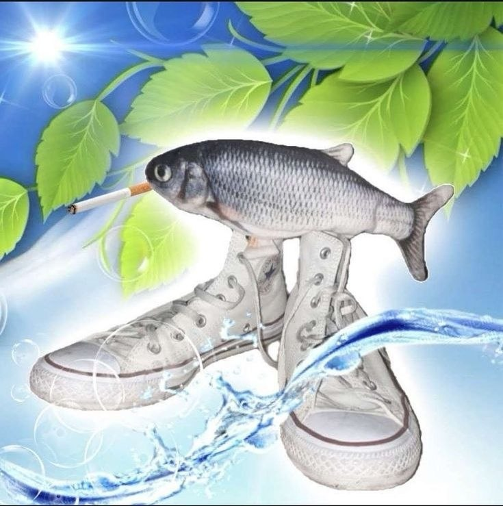

# Лабораторная работа №1
Березкина Наталья Сергеевна 6404-010302D.
Научный руководитель: Трусова Алла Юрьевна.
Примерная тема диплома: "Прогнозирование экономических показателей эконометрическим моделированием".
Любимая цитата философа: "Все, что нас не убивает, делает нас сильнее" © Ф.Ницше.
Картинка смешная (по моему мнению):
